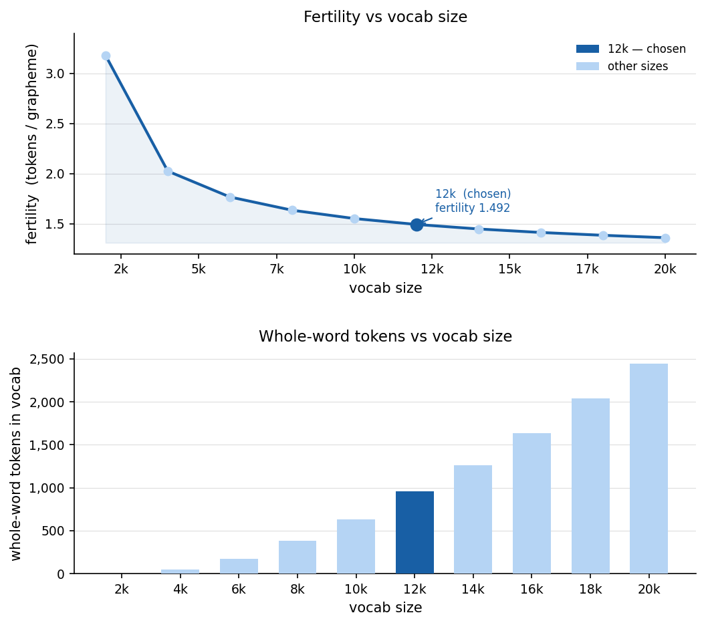

# Training the sin_eng vocabulary

This directory contains the full data pipeline for training the built-in `sin_eng` BPE vocabulary. The pipeline has four steps: download -> inspect -> clean -> train.

## Prerequisites

Install the training dependencies from the project root:

```bash
pip install -e ".[train]"
```

## Step 1 - Download corpora

`data_downloader.py` fetches three Sinhala corpora and writes them to `data/` as plain UTF-8 text files. Each line is NFC-normalized (Unicode canonical decomposition followed by canonical composition) and whitespace-stripped at download time, so all subsequent steps work from a consistent encoding baseline.

```bash
python scripts/data_downloader.py
```

| Dataset | Source | Approx. size |
|---------|--------|-------------|
| CC-100 | [data.statmt.org](https://data.statmt.org/cc-100/) | ~3–4 GB |
| Wikipedia | wikimedia/wikipedia (HuggingFace) | ~100 MB |
| CulturaX | uonlp/CulturaX (HuggingFace, gated) | ~6–7 GB |

CulturaX requires accepting the dataset licence on HuggingFace and passing your token:

```bash
python scripts/data_downloader.py --hf-token hf_...
```

Datasets already present on disk are skipped automatically. To skip a dataset entirely:

```bash
python scripts/data_downloader.py --skip culturax
```

Output structure:

```
data/
├── cc100/si.txt
├── wikipedia/si.txt
└── culturax/si.txt
```

## Step 2 - Inspect raw data (optional)

`diff_sample.py` samples lines from a raw corpus and writes a unified diff showing exactly what the cleaner would do to each line - useful for understanding the data and sanity-checking the cleaning rules before committing a full run.

```bash
python scripts/diff_sample.py --dataset wikipedia
```

The output is a `.diff` file that VS Code renders natively with colour highlighting:

```
data/diff/wikipedia/sample.diff
```

```bash
# Sample 500 lines, every 200th line from cc100
python scripts/diff_sample.py --dataset cc100 --n 500 --every-n 200
```

## Step 3 - Clean corpora

`data_cleaner.py` filters and repairs each corpus file, writing cleaned output to `data/clean/`.

```bash
python scripts/data_cleaner.py
```

Each line goes through the following pipeline:

1. **Script filter** - drops lines containing characters outside Sinhala, Latin, or common Unicode ranges (e.g. Tamil, Arabic, CJK).
2. **Character fixes** - strips ZWNJ, invalid ZWJ sequences, repeated combining marks, and control characters.
3. **Syntax filter** - drops lines with invalid Sinhala combining sequences per SLS 1134:2011 (validated by `sinhala_validator.py`).
4. **Length filter** - drops lines shorter than `--min-length` characters after cleaning.

```bash
# Adjust minimum line length
python scripts/data_cleaner.py --min-length 20

# Skip a dataset
python scripts/data_cleaner.py --skip wikipedia
```

Output structure:

```
data/clean/
├── cc100/si.txt
├── wikipedia/si.txt
└── culturax/si.txt
```

## Step 4 - Train

`sin_eng_trainer.py` reads the cleaned corpora, trains a BPE vocabulary with `GraphemePreTokenizer`, and saves it to `akuru_token/vocabs/sin_eng.json`.

```bash
python scripts/sin_eng_trainer.py
```

Key options:

```bash
python scripts/sin_eng_trainer.py \
    --vocab-size 12000 \
    --min-frequency 2 \
    --progress 500
```

| Flag | Default | Description |
|------|---------|-------------|
| `--vocab-size` | `12000` | Target vocabulary size |
| `--min-frequency` | `2` | Minimum pair frequency to merge |
| `--data-dir` | `data/clean` | Directory containing cleaned corpora |
| `--output` | `akuru_token/vocabs/sin_eng.json` | Output path |
| `--force` | off | Overwrite output file if it already exists |
| `--progress` | `500` | Log a progress line every N merges |

Training logs to stdout via Python's `logging` module. A full run across all three corpora takes roughly 30–60 minutes depending on hardware.

### Choosing vocab size

The built-in `sin_eng` vocabulary uses 12,000 tokens. This was chosen by measuring fertility (tokens per word) across vocabulary sizes from 2,000 to 20,000 on a 2M Sinhala sample from the same corpora:

| vocab | fertility | whole-word tokens | mean grapheme length | p90 grapheme length |
|------:|----------:|------------------:|---------------------:|--------------------:|
|  2000 |     3.178 |                 0 |                 2.12 |                   2 |
|  4000 |     2.024 |                48 |                 2.56 |                   4 |
|  6000 |     1.766 |               175 |                 2.75 |                   4 |
|  8000 |     1.634 |               380 |                 2.88 |                   4 |
| 10000 |     1.551 |               628 |                 2.98 |                   4 |
| **12000** | **1.492** | **955** |             **3.07** |               **5** |
| 14000 |     1.447 |             1,261 |                 3.14 |                   5 |
| 18000 |     1.384 |             2,036 |                 3.25 |                   5 |
| 20000 |     1.360 |             2,446 |                 3.29 |                   5 |



The fertility curve has a clear inflection point around 8,000–12,000. The step from 8k to 12k yields a fertility improvement of 0.142; the next equivalent step (12k to 14k) yields only 0.045, and returns continue to diminish beyond that. Beyond 12k the merge budget is spent primarily on absorbing rare inflected word forms rather than compositionally useful syllabic and morphemic units.

This matters more for Sinhala than for English: Sinhala is moderately agglutinative, so whole-word tokens (955 at 12k) cover a narrow set of frequent inflected forms and do not generalise across the morphological space. The `p90_gl` column (grapheme length at the 90th percentile of merged tokens) stabilises at 5 from 12k onwards, confirming that additional merges beyond this point are not learning qualitatively longer or more useful tokens.

12k keeps the embedding table and softmax layer lean at a fertility of 1.492.

## Sinhala validator

`sinhala_validator.py` is used internally by the cleaner but can also be used standalone to inspect specific lines:

```python
from sinhala_validator import find_invalid

find_invalid("කිරිබත්")   # None  - valid
find_invalid("කිරි‍බත්")  # 4     - invalid ZWJ sequence at index 4
```
